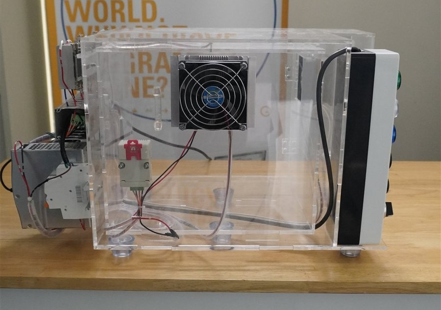
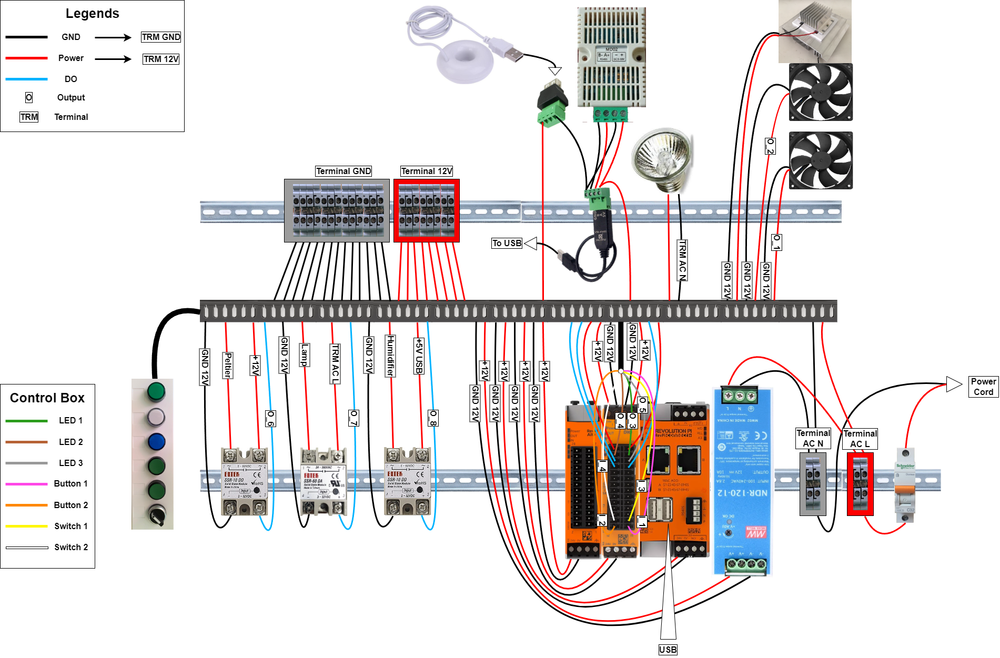
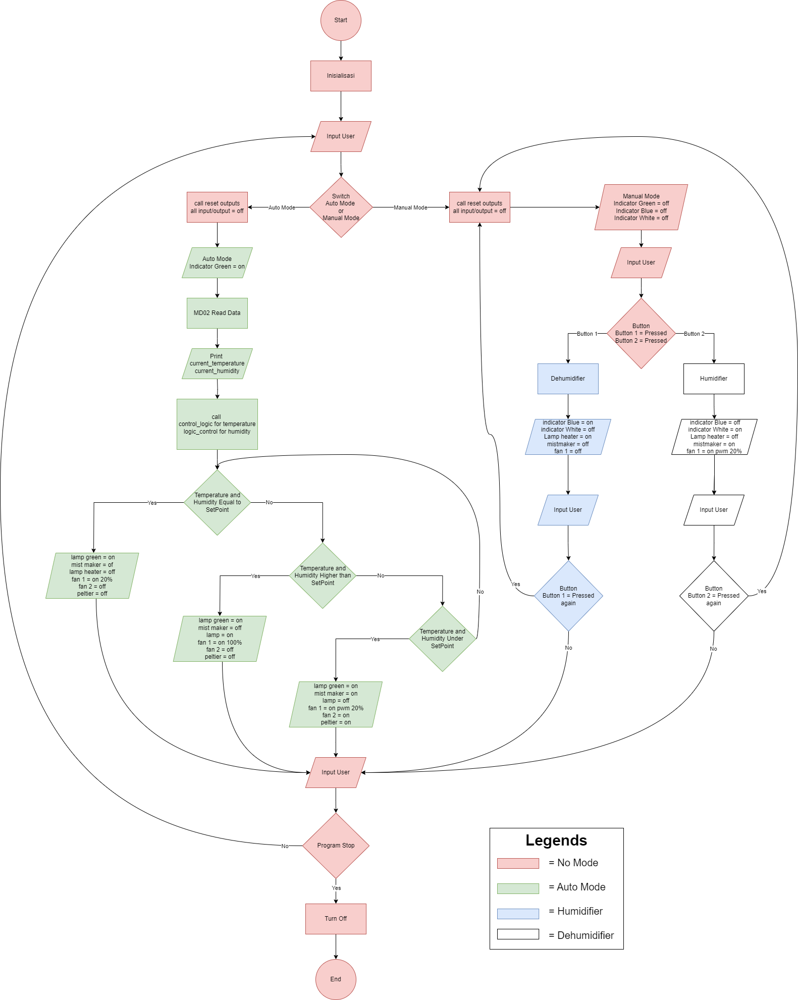
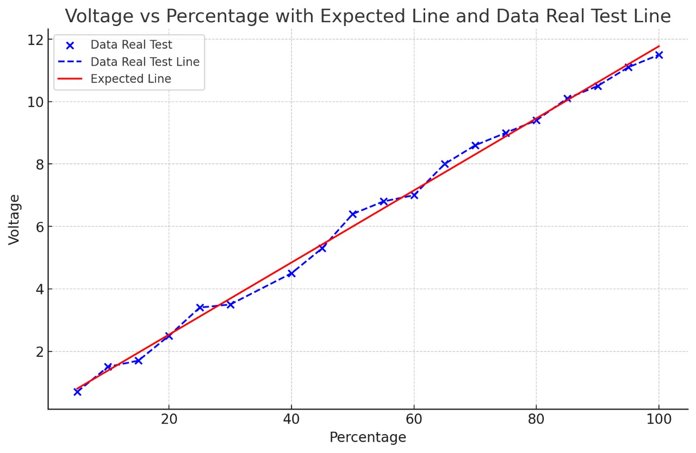
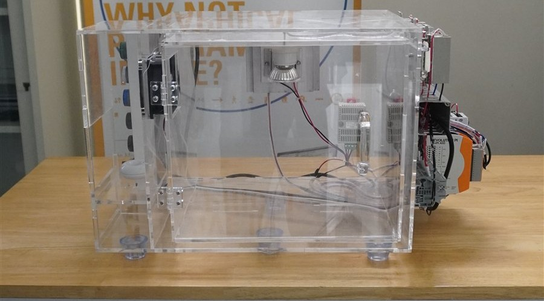

# Humidity Chamber IIoT Control System

An Industrial IoT (IIoT) temperature and humidity control system built on a
Revolution Pi (RevPi) PLC, developed as the final project for CCIT — Fakultas
Teknik Universitas Indonesia (August 2024), during a STEM Education & Robotics
internship context.

## Overview

The project implements closed-loop control of temperature and humidity inside
a sealed acrylic trainer chamber, used to demonstrate IIoT concepts: sensor
acquisition, actuator control (Peltier module, dry/cooling fans, humidifier),
and PLC-based automation logic exposed over industrial IoT protocols.

- **Controller:** Revolution Pi (RevPi) — Raspberry Pi–based open PLC
- **Sensors:** Temperature & humidity sensing inside the chamber
- **Actuators:** Peltier element (heating/cooling), dual fans (variable speed
  via PWM), humidifier/dehumidifier module
- **Modes:** Manual mode (direct actuator control via buttons) and Auto mode
  (closed-loop setpoint control reading live temperature/humidity)
- **Protocols & integration:** Modbus RTU over serial (RS-485) to poll the
  MD02 temperature/humidity sensor, with terminal-block wiring for GND/12V/AC
  power distribution
- **Software:** Python control program running on the RevPi, using
  `revpimodio2` for PLC I/O and `pyserial` for Modbus communication

## System Architecture

**Wiring & terminal layout** — power distribution, RevPi I/O, and
sensor/actuator terminals:

**Control flow** — Manual vs. Auto mode logic, including how the system reads
setpoints, polls sensors, and drives actuators each cycle:

## Source Code

📄 [`src/chambercontrol.py`](src/chambercontrol.py) — the control program running
on the RevPi:

- **Sensor polling:** builds and sends Modbus RTU request frames (with CRC16
  checksum) over a serial connection to read live temperature and humidity
  from the MD02 sensor
- **Auto mode:** runs on its own thread, continuously reading sensor values
  and driving the heater/cooler (Peltier), fan PWM, and
  humidifier/dehumidifier outputs based on temperature and humidity setpoints
- **Manual mode:** reads physical button/switch inputs on the RevPi to toggle
  the humidifier and dehumidifier directly, with debounced edge-detection on
  each button press
- **Mode switching:** a physical switch input flips between Auto and Manual
  mode at runtime, safely stopping the auto-mode thread and resetting all
  outputs before handing control back to manual mode

## Validation / Test Results

PWM duty cycle vs. measured output voltage was tested against the expected
linear response to validate actuator control accuracy:

## Hardware

## Final Paper

The full final project report — methodology, design, implementation, and
test results — is included here:

📄 [Humidity Chamber Final Paper (PDF)](docs/paper/Humidity-Chamber-Final-Paper.pdf)

## Author

**Ryan Aric Ardhani**
